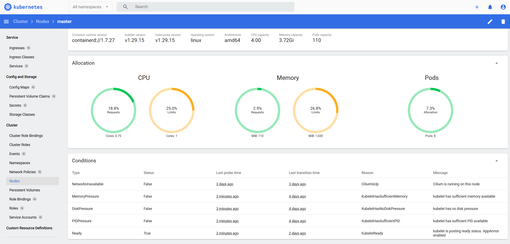
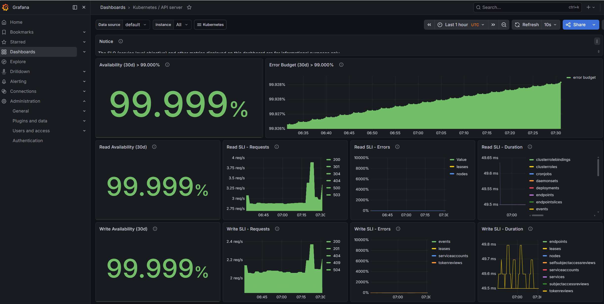
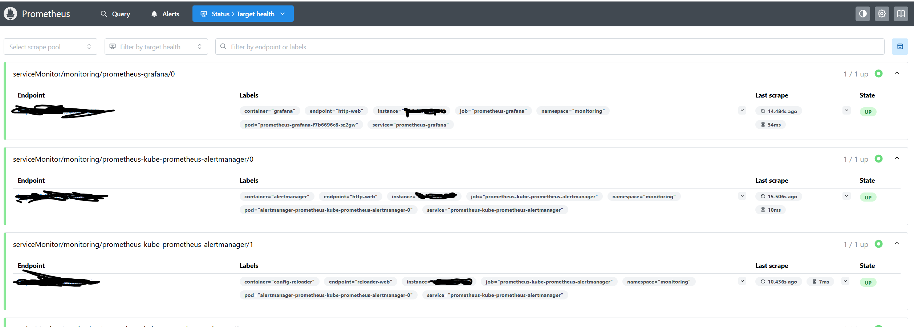

# Observability > Kubernetes Dashboard, Prometheus & Grafana

Up to this phase, everything in this lab was CLI-only. `kubectl get nodes`, `kubectl get pods`, squinting at terminal output trying to figure out if a pod is actually healthy or just pretending. This phase changes that - Dashboard, Prometheus, and Grafana go in, and suddenly the cluster isn't a black box anymore.

Below is what I installed, why each piece exists, and how to get into all three.

## What each tool is actually for

These three get lumped together a lot, but they solve different problems:

- **Kubernetes Dashboard** - the official web UI. See what's running, check pod logs, look at events, manage resources from a browser instead of `kubectl`.
- **Prometheus** - a metrics database. Scrapes numbers every 30s (CPU, memory, request counts) from everything in the cluster and stores them over time. It collects, it doesn't display.
- **Grafana** - reads from Prometheus and draws the charts. This is what you actually stare at when you want to know what's going on with performance.

Quick mental model:

```
Prometheus  →  the recorder
Grafana     →  the screen
Dashboard   →  the control panel
```

## Where everything sits in the cluster

```
My cluster
│
├── kube-system
│     ├── metrics-server        ← feeds kubectl top
│     ├── cilium (x3)           ← pod networking
│     ├── coredns (x2)          ← internal DNS
│     └── kube-proxy (x3)       ← per-node network routing
│
├── monitoring
│     ├── prometheus            ← scrapes every 30s
│     ├── grafana               ← charts from prometheus
│     ├── alertmanager          ← fires alerts
│     ├── kube-state-metrics    ← watches K8s objects
│     └── node-exporter (x3)    ← one per node, OS-level stats
│
├── kubernetes-dashboard
│     ├── dashboard-web
│     ├── dashboard-api
│     ├── dashboard-auth
│     └── dashboard-kong
│
└── default
      └── nginx (x2)            ← test deployment
```

node-exporter sits on every node and pulls OS-level stats - CPU, disk I/O, memory, network. kube-state-metrics watches the K8s API itself - pod counts, desired vs running replicas, that kind of thing. Both feed Prometheus, and Grafana queries Prometheus to draw the dashboards.

## Installing the Dashboard

```bash
helm repo add kubernetes-dashboard https://kubernetes.github.io/dashboard/
helm repo update

helm upgrade --install kubernetes-dashboard kubernetes-dashboard/kubernetes-dashboard \
  --create-namespace \
  --namespace kubernetes-dashboard
```

Check it came up clean:

```bash
kubectl get pods -n kubernetes-dashboard
```

### Admin service account

Dashboard needs cluster-admin rights to actually show you everything:

```bash
cat <<EOF | kubectl apply -f -
apiVersion: v1
kind: ServiceAccount
metadata:
  name: admin-user
  namespace: kubernetes-dashboard
---
apiVersion: rbac.authorization.k8s.io/v1
kind: ClusterRoleBinding
metadata:
  name: admin-user
roleRef:
  apiGroup: rbac.authorization.k8s.io
  kind: ClusterRole
  name: cluster-admin
subjects:
- kind: ServiceAccount
  name: admin-user
  namespace: kubernetes-dashboard
EOF
```

### A token that doesn't expire on you every hour

```bash
cat <<EOF | kubectl apply -f -
apiVersion: v1
kind: Secret
metadata:
  name: admin-user-token
  namespace: kubernetes-dashboard
  annotations:
    kubernetes.io/service-account.name: admin-user
type: kubernetes.io/service-account-token
EOF
```

Pull it:

```bash
kubectl -n kubernetes-dashboard get secret admin-user-token \
  -o jsonpath="{.data.token}" | base64 -d
```

Save it. It's permanent.

### Exposing it

```bash
kubectl patch svc kubernetes-dashboard -n kubernetes-dashboard \
  --type='json' \
  -p='[{"op":"replace","path":"/spec/type","value":"NodePort"}]'

kubectl get svc -n kubernetes-dashboard
```

Then in browser:

```
https://<ANY_NODE_IP>:<NODE_PORT>
```

Click through the cert warning, paste the token, you're in.




## Installing Prometheus + Grafana

Both come bundled via `kube-prometheus-stack` — one chart, sets up everything including the pre-built Grafana dashboards. No reason to install them separately.

```bash
helm repo add prometheus-community https://prometheus-community.github.io/helm-charts
helm repo update

helm install prometheus prometheus-community/kube-prometheus-stack \
  --namespace monitoring \
  --create-namespace
```

```bash
kubectl get pods -n monitoring
# prometheus, grafana, alertmanager, kube-state-metrics,
# node-exporter (one per node)
```

### Exposing Grafana

```bash
kubectl patch svc prometheus-grafana -n monitoring \
  --type='json' \
  -p='[{"op":"replace","path":"/spec/type","value":"NodePort"}]'

kubectl get svc prometheus-grafana -n monitoring
```

Credentials:

```bash
# username
kubectl get secret -n monitoring prometheus-grafana \
  -o jsonpath="{.data.admin-user}" | base64 -d

# password
kubectl get secret -n monitoring prometheus-grafana \
  -o jsonpath="{.data.admin-password}" | base64 -d
```

```
http://<ANY_NODE_IP>:<GRAFANA_PORT>
```

Change the password immediately — Profile → Change Password.

### Exposing Prometheus (optional, for raw querying)

```bash
kubectl patch svc prometheus-kube-prometheus-prometheus -n monitoring \
  --type='json' \
  -p='[{"op":"replace","path":"/spec/type","value":"NodePort"}]'

kubectl get svc prometheus-kube-prometheus-prometheus -n monitoring
```

```
http://<ANY_NODE_IP>:<PROMETHEUS_PORT>
```

## Metrics Server (needed for `kubectl top`)

Without this, `kubectl top nodes` and the CPU/memory graphs in Dashboard just don't work.

```bash
kubectl apply -f https://github.com/kubernetes-sigs/metrics-server/releases/latest/download/components.yaml
```

kubeadm uses self-signed kubelet certs, so patch around it:

```bash
kubectl patch deployment metrics-server -n kube-system \
  --type='json' \
  -p='[{"op":"add","path":"/spec/template/spec/containers/0/args/-","value":"--kubelet-insecure-tls"}]'
```

```bash
kubectl top nodes
# NAME     CPU(cores)   CPU%   MEMORY(bytes)   MEMORY%
# master   433m         10%    2344Mi          61%
# node1    260m         6%     1711Mi          44%
# node2    328m         8%     2014Mi          52%
```

## What I actually check in each tool

**Dashboard**
- Cluster → Nodes — all 3 nodes, CPU/memory per node
- Workloads → Pods — full pod list across namespaces, live status
- Workloads → Deployments — nginx at 2/2
- Click a pod → Logs — live tail, right in the browser

**Prometheus** — useful queries:

```promql
up
node_memory_MemAvailable_bytes
100 - (avg by(instance) (rate(node_cpu_seconds_total{mode="idle"}[5m])) * 100)
```

**Grafana** — the chart ships pre-loaded dashboards, mainly using:
- Kubernetes / Compute Resources / Cluster
- Kubernetes / Compute Resources / Node
- Node Exporter / Nodes


## How the data actually flows

```
node-exporter (master, node1, node2)
    │ CPU, memory, disk, network
    ▼
kube-state-metrics (watches the K8s API)
    │ pod phases, replica counts, resource requests
    ▼
Prometheus
    scrapes both every 30s, stores it as time-series
    │
    ▼
Grafana
    queries Prometheus, renders it as something readable
    │
    ▼
me, in a browser, finally able to see what the cluster's doing
```
