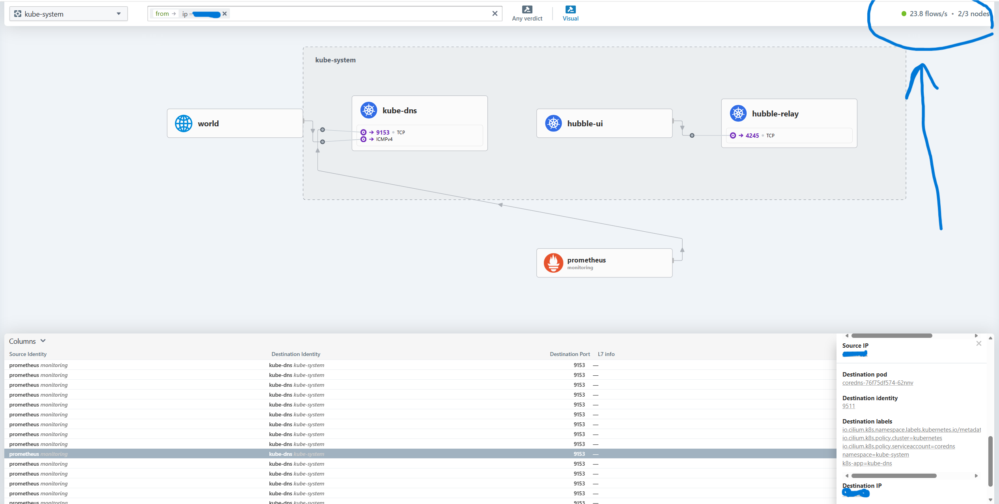

# Kubernetes Cluster changes :Cilium Upgrade

## Cluster Overview

The environment consists of a three-node Kubernetes cluster with one control-plane node and two worker nodes. All nodes run Ubuntu 24 and use containerd as the container runtime. The cluster was set up using kubeadm and uses Cilium as the CNI plugin.

## Summary

This document covers the issues I encountered on the cluster, how I diagnosed and resolved each one, and the deliberate improvements I made to the networking layer based on guidance from my manager. The key outcomes were restoring full cluster health, upgrading Cilium to run in kube-proxy replacement mode using eBPF, enabling Hubble for network observability, and removing conflicting components.

## Issue 1: kubectl Stopped Working - API Server Unreachable

**What I observed**

kubectl commands were failing with connection refused errors. The kubelet service was running fine but could not reach the Kubernetes API server on localhost. Running a port check showed nothing was listening on port 6443 on the loopback interface, though the API server was reachable on the node's primary IP.

**Root cause**

The kube-apiserver static pod was bound only to the node's specific IP address rather than all network interfaces. Internal cluster components that use localhost or 127.0.0.1 to reach the API server were therefore refused. This happens when a node's IP changes after the initial kubeadm setup - the API server starts binding only to the advertised IP instead of all interfaces.

**How I fixed it**

I edited the kube-apiserver static pod manifest and added the --bind-address flag:

```bash
sudo vi /etc/kubernetes/manifests/kube-apiserver.yaml
```

Added inside the command section:

```yaml
- --bind-address=0.0.0.0
```

Since kubelet watches the /etc/kubernetes/manifests/ directory, it automatically detected the change and restarted the API server pod without any manual intervention needed.

**What I learned**

The --advertise-address flag tells other components which IP to use to reach the API server, but --bind-address controls which interfaces the server actually listens on. Setting --bind-address=0.0.0.0 makes the API server listen on all interfaces and prevents this class of issue from recurring after network changes.

## Issue 2: Port-Forward Failing with Unauthorized Error

**What I observed**

Running kubectl port-forward to access the Kubernetes dashboard was returning Unauthorized errors intermittently, and sometimes timing out entirely.

**Root cause**

Two problems combined. The kubeconfig in use did not have sufficient permissions for port-forward operations. Additionally, the dashboard pod was scheduled on a worker node whose kubelet was misbehaving, causing the streaming connection to fail.

**How I fixed it**

I replaced my kubeconfig with the admin credentials generated by kubeadm:

```bash
sudo cp /etc/kubernetes/admin.conf $HOME/.kube/config
sudo chown $(id -u):$(id -g) $HOME/.kube/config
```

**What I learned**

kubeadm generates an admin.conf file with full cluster-admin privileges. Operations like port-forward require the ability to open a streaming connection to the kubelet on the node where the pod runs, which needs elevated RBAC permissions. Always use the admin kubeconfig for administrative tasks.

## Issue 3: Worker Node SSH Host Key Changed

**What I observed**

Attempting to SSH into one of the worker nodes from my workstation was blocked with a warning that the remote host identification had changed and host key verification had failed.

**Root cause**

The worker node had been rebuilt or reimaged at some point, which caused its SSH host keys to be regenerated. My workstation's known_hosts file still held the old fingerprint.

**How I fixed it**

I cleared the stale key from my workstation:

```bash
ssh-keygen -R <worker-node-ip>
```

Then reconnected and accepted the new fingerprint when prompted.

**What I learned**

SSH stores a fingerprint of each host it connects to in ~/.ssh/known_hosts as a security measure against man-in-the-middle attacks. When a server is rebuilt its keys change, and SSH blocks the connection to protect you. The fix is to remove the old entry with ssh-keygen -R and reconnect to accept the new key. This is expected behaviour after a node rebuild, not a security incident.

## Issue 4: Worker Node NotReady - Kubelet Stopped Posting Status

**What I observed**

kubectl get nodes showed one worker node as NotReady with the reason NodeStatusUnknown: Kubelet stopped posting node status. The Cilium agent on that node was also logging repeated HTTP/2 connection lost errors to the API server.

**Root cause**

The kubelet process had lost its connection to the API server and stopped sending heartbeats. Kubernetes marks a node NotReady after it misses heartbeats for a configured period called the node-monitor-grace-period, which defaults to 40 seconds. The underlying cause was intermittent TCP connection resets between the worker node and the control plane.

**How I fixed it**

I SSH'd into the affected worker node and restarted kubelet:

```bash
sudo systemctl restart kubelet
sudo systemctl status kubelet
```

Then watched the node recover from the control plane:

```bash
kubectl get nodes -w
```

**What I learned**

Kubernetes uses a node lease mechanism where kubelets post heartbeats to the API server every few seconds. If heartbeats stop, the control plane marks the node unknown. Restarting kubelet re-establishes the connection and resumes heartbeating. The deeper issue of why connections were resetting pointed to Docker running on the node alongside Cilium, which I resolved later.

## Issue 5: kube-state-metrics in CrashLoopBackOff

**What I observed**

The kube-state-metrics pod in the monitoring namespace was stuck in CrashLoopBackOff. Logs showed it could not reach the internal Kubernetes ClusterIP on port 443, timing out with an i/o timeout error.

**Root cause**

The pod was trying to reach the kubernetes service ClusterIP, which is how pods inside the cluster communicate with the API server. This routing was broken on the affected worker node because Cilium was running alongside kube-proxy in a conflicting configuration, causing inconsistent service routing rules. This was resolved as part of the Cilium upgrade described below.

## Planned Improvement: Cilium kube-proxy Replacement and Hubble

**Why this was needed**

My manager identified that running kube-proxy alongside Cilium was incorrect and was causing networking conflicts. Cilium is designed to replace kube-proxy entirely using eBPF, a Linux kernel technology that handles network routing more efficiently than iptables. Running both creates duplicate and conflicting routing rules, which was the root cause of the ClusterIP timeout and the intermittent connection resets on the worker node.

Additionally, Hubble, which is Cilium's built-in observability layer, was not enabled. My manager required this to be running so we have real-time visibility into network flows between pods.

**Step 1: Added the Cilium Helm repository**

The Helm repo was not present on the cluster, so I added it first:

```bash
helm repo add cilium https://helm.cilium.io/
helm repo update
```

**Step 2: Upgraded Cilium via Helm**

I upgraded the existing Cilium installation to enable kube-proxy replacement and Hubble:

```bash
helm upgrade cilium cilium/cilium \
  --namespace kube-system \
  --reuse-values \
  --set kubeProxyReplacement=true \
  --set k8sServiceHost=<control-plane-ip> \
  --set k8sServicePort=6443 \
  --set hubble.relay.enabled=true \
  --set hubble.ui.enabled=true
```

This upgraded Cilium to version 1.19.5 and triggered a rolling restart of all Cilium pods across the cluster. The flags I used:

--reuse-values keeps all existing configuration and only overrides what I specified explicitly.
kubeProxyReplacement=true tells Cilium to fully replace kube-proxy using eBPF.
k8sServiceHost and k8sServicePort tell Cilium where the API server is, which is required when kube-proxy replacement is enabled since Cilium itself needs to bootstrap before any service routing exists.
hubble.relay.enabled=true enables the Hubble relay that aggregates flows from all nodes.
hubble.ui.enabled=true deploys the Hubble web dashboard.

**Step 3: Confirmed kube-proxy replacement was active**

```bash
kubectl get configmap -n kube-system cilium-config -o yaml | grep kube-proxy-replacement
```

Output confirmed: kube-proxy-replacement: "true"

**Step 4: Removed kube-proxy**

With Cilium fully handling service routing, kube-proxy was no longer needed:

```bash
kubectl -n kube-system delete daemonset kube-proxy
kubectl -n kube-system delete configmap kube-proxy
```

All nodes remained Ready after removal, confirming Cilium took over service routing cleanly.

**Step 5: Removed orphaned test workloads**

A test deployment was running in the default namespace and was no longer needed:

```bash
kubectl delete deployment nginx -n default
```

**Step 6: Installed the Hubble CLI**

The Hubble observe CLI is separate from the cilium CLI and needs to be installed independently:

```bash
HUBBLE_VERSION=$(curl -s https://raw.githubusercontent.com/cilium/hubble/master/stable.txt)
curl -L --remote-name-all https://github.com/cilium/hubble/releases/download/$HUBBLE_VERSION/hubble-linux-amd64.tar.gz
tar xzvf hubble-linux-amd64.tar.gz
sudo mv hubble /usr/local/bin/
```

**Step 7: Accessed Hubble UI**

```bash
kubectl -n kube-system port-forward --address 0.0.0.0 svc/hubble-ui 12000:80
```

Opened browser at http://[control-plane-ip]:12000 and confirmed the Hubble service map was live, showing real-time pod-to-pod traffic flows across namespaces.


## Issue 6: Docker Running on a Cilium-Managed Node

**What I observed**

While investigating why the Hubble relay could not consistently connect to one worker node, I found Docker was installed and actively running on that node with its own bridge network and a running container.

**Root cause**

Docker creates its own bridge networking (docker0) and manages iptables rules independently. This conflicted with Cilium's eBPF-based routing, causing TCP connections from the Hubble relay to be reset intermittently. Kubernetes worker nodes managed by Cilium should use containerd as the sole container runtime with no Docker daemon running.

**How I fixed it**

```bash
sudo systemctl stop docker
sudo systemctl disable docker
sudo systemctl disable docker.socket
sudo systemctl stop docker.socket
```

Then restarted Cilium on the cluster to clear any stale network rules left behind by Docker:

```bash
kubectl rollout restart daemonset/cilium -n kube-system
kubectl rollout status daemonset/cilium -n kube-system
```

**What I learned**

Docker and Cilium cannot coexist cleanly on the same node. Docker manages its own iptables rules and bridge interfaces which conflict with Cilium's eBPF programs. In a modern Kubernetes cluster using Cilium, the only container runtime that should be running is containerd, which Cilium and kubelet integrate with directly.

## Known Issue: Hubble Relay Showing 2/3 Nodes

The Hubble relay consistently shows flows from 2 out of 3 nodes. The affected worker node's Cilium agent reports Hubble as healthy locally, port 4244 is reachable, and the node itself is Ready and running workloads correctly. The relay connects successfully but then receives a TLS certificate verification error from the Cilium CA.

This appears to be a certificate trust issue specific to this node stemming from it having been rebuilt mid-cluster-life, leaving its Cilium CA certificates out of sync with the rest of the cluster. The node's workloads and networking function correctly - this only affects Hubble flow visibility for that node.

This is noted as a pending item to resolve with a full node rebuild using kubeadm join to rejoin the cluster cleanly.

## Final Cluster State

```
cilium status:
  Cilium:          OK
  Operator:        OK
  Envoy DaemonSet: OK
  Hubble Relay:    OK
  Hubble UI:       OK

All nodes Ready:
  control-plane    Ready
  worker-1         Ready
  worker-2         Ready

kube-proxy:        removed
Docker on nodes:   disabled
```

## Key Cilium and Hubble Commands

```bash
# Overall cluster health
cilium status

# List all pods/endpoints Cilium is managing
cilium endpoint list

# Check active network policies
cilium policy get

# Monitor live traffic events at the kernel level
cilium monitor

# Observe live network flows across the cluster
hubble observe

# Follow flows in real time
hubble observe --follow

# Filter flows by namespace
hubble observe --namespace monitoring --follow

# Show only dropped or denied traffic
hubble observe --verdict DROPPED

# Run built-in Cilium connectivity tests
cilium connectivity test
```

## References

Cilium official documentation and getting started guide
https://docs.cilium.io/en/stable/

Cilium kube-proxy replacement documentation
https://docs.cilium.io/en/stable/network/kubernetes/kubeproxy-free/

Hubble setup and observability guide
https://docs.cilium.io/en/stable/observability/hubble/setup/

Cilium Helm chart configuration reference
https://docs.cilium.io/en/stable/helm-reference/

Kubernetes node troubleshooting
https://kubernetes.io/docs/tasks/debug/debug-cluster/

kubeadm certificate management
https://kubernetes.io/docs/tasks/administer-cluster/kubeadm/kubeadm-certs/
