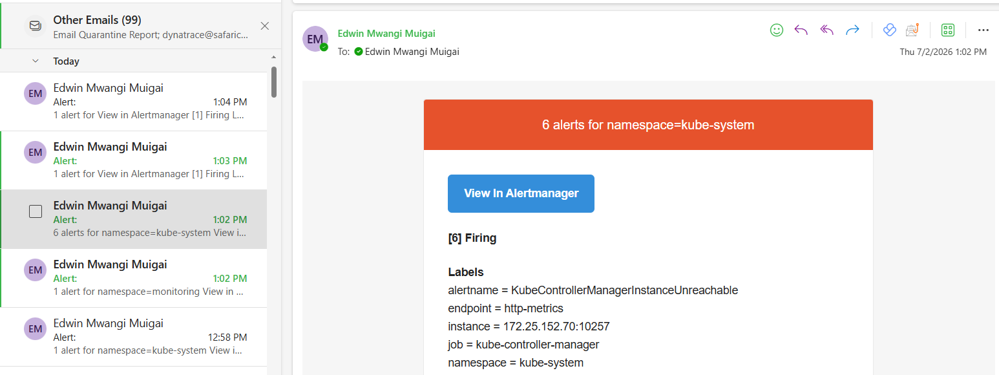

# Setting Up Alertmanager Email Notifications

## Export Current Config

```bash
kubectl get secret -n monitoring alertmanager-prometheus-kube-prometheus-alertmanager \
  -o jsonpath='{.data.alertmanager\.yaml}' | base64 -d > alertmanager.yaml
```

## Edit Config File

```bash
nano alertmanager.yaml
```

Replace with this:

```yaml
global:
  resolve_timeout: 5m
  smtp_smarthost: 'smtp.office365.com:587'
  smtp_auth_username: '<YOUR_EMAIL>'
  smtp_auth_password: '<YOUR_PASSWORD>'
  smtp_require_tls: true
  smtp_from: '<YOUR_EMAIL>'

inhibit_rules:
- equal:
  - namespace
  - alertname
  source_matchers:
  - severity = critical
  target_matchers:
  - severity =~ warning|info
- equal:
  - namespace
  - alertname
  source_matchers:
  - severity = warning
  target_matchers:
  - severity = info
- equal:
  - namespace
  source_matchers:
  - alertname = InfoInhibitor
  target_matchers:
  - severity = info
- target_matchers:
  - alertname = InfoInhibitor

receivers:
- name: "email-alerts"
  email_configs:
  - to: '<YOUR_EMAIL>'
    headers:
      Subject: 'Alert: {{ .GroupLabels.alertname }}'

route:
  receiver: "email-alerts"
  group_by:
  - namespace
  group_interval: 5m
  group_wait: 30s
  repeat_interval: 12h
  routes:
  - matchers:
    - alertname = "Watchdog"
    receiver: "email-alerts"

templates:
- /etc/alertmanager/config/*.tmpl
```

Save: `Ctrl+X` → `Y` → `Enter`

## Apply Config

```bash
kubectl patch secret -n monitoring alertmanager-prometheus-kube-prometheus-alertmanager \
  --type merge -p "{\"data\":{\"alertmanager.yaml\":\"$(base64 -w0 < alertmanager.yaml)\"}}"
```

## Restart Alertmanager

```bash
kubectl rollout restart statefulset -n monitoring \
  alertmanager-prometheus-kube-prometheus-alertmanager
```

## Verify

Check logs:

```bash
kubectl logs -n monitoring alertmanager-prometheus-kube-prometheus-alertmanager-0 | tail -5
```

Should show: `Completed loading of configuration file`

## Access Alertmanager UI

### Option 1: Via Route (if exposed)

Go to: `https://<CLUSTER_URL>:9094/#/status`

### Option 2: Via Port-Forward

```bash
kubectl port-forward -n monitoring svc/prometheus-kube-prometheus-alertmanager 9093:9093
```

Then open browser: `http://localhost:9093`

### Verify Config

Click **Status** tab. Config section should show your email receiver (not "null").

## Result

Alerts now email you automatically. Real alerts fire within minutes and land in your inbox. Screenshot shown below.

