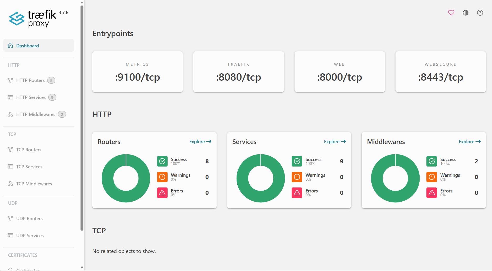

# Traefik API Gateway Setup

Traefik is a modern API Gateway that routes traffic to different services based on rules. Unlike Nginx Ingress, it offers advanced features like rate limiting, authentication, and dynamic routing.

## Architecture

```
Browser Request (Port 80)
    ↓
Traefik Pod (API Gateway)
    ↓
IngressRoute Rules
    ↓
Backend Services (Grafana, Prometheus, Alertmanager)
```

## Steps I did in Installation

### Step 1: Add Helm Repository

```bash
helm repo add traefik https://traefik.github.io/charts
helm repo update
```

### Step 2: Deploy Traefik

```bash
helm install traefik traefik/traefik \
  -n traefik --create-namespace \
  --set ports.web.port=80 \
  --set ports.web.nodePort=80 \
  --set ports.websecure.nodePort=443 \
  --set service.type=NodePort
```

### Step 3: Verify Deployment

```bash
kubectl get pods -n traefik
kubectl get svc -n traefik
```

Expected output:

```
NAME                      READY   STATUS
traefik-xxxxx             1/1     Running

NAME      TYPE           PORT(S)
traefik   LoadBalancer   80:80/TCP, 443:443/TCP
```

## Configure Routing Rules

Created IngressRoutes for the services:

```bash
kubectl apply -f - <<EOF
apiVersion: traefik.io/v1alpha1
kind: IngressRoute
metadata:
  name: grafana-route
  namespace: monitoring
spec:
  entryPoints:
  - web
  routes:
  - match: Host(\`grafana.lab\`)
    kind: Rule
    services:
    - name: prometheus-grafana
      port: 80
---
apiVersion: traefik.io/v1alpha1
kind: IngressRoute
metadata:
  name: prometheus-route
  namespace: monitoring
spec:
  entryPoints:
  - web
  routes:
  - match: Host(\`prometheus.lab\`)
    kind: Rule
    services:
    - name: prometheus-kube-prometheus-prometheus
      port: 9090
---
apiVersion: traefik.io/v1alpha1
kind: IngressRoute
metadata:
  name: alertmanager-route
  namespace: monitoring
spec:
  entryPoints:
  - web
  routes:
  - match: Host(\`alertmanager.lab\`)
    kind: Rule
    services:
    - name: prometheus-kube-prometheus-alertmanager
      port: 9093
EOF
```

## Local Domain Setup

Did update Windows hosts file (`C:\Windows\System32\drivers\etc\hosts`):

```
<CLUSTER_NODE_IP>  grafana.lab
<CLUSTER_NODE_IP>  prometheus.lab
<CLUSTER_NODE_IP>  alertmanager.lab
<CLUSTER_NODE_IP>  api.lab
```

Example:

```
192.168.0.1  grafana.lab
```

## Verify Routes

Check created IngressRoutes:

```bash
kubectl get ingressroute -n monitoring
```

## Access Services

### Via IP (bypasses proxy)

```
http://<CLUSTER_NODE_IP>/
```

### Via Domain (on cluster network)

```
http://grafana.lab/
http://prometheus.lab/
http://alertmanager.lab/
```

### Traefik Dashboard

```
http://<CLUSTER_NODE_IP>:8080/dashboard/
```

## What I Accomplished

✅ Deployed Traefik API Gateway on Kubernetes
✅ Configured dynamic traffic routing via IngressRoutes
✅ Set up local domains for internal services
✅ Enabled multi-service access through single gateway
✅ Production-grade API Gateway on home lab

## Key Features Enabled

- **Dynamic Routing:** Routes requests to correct backend based on Host header
- **Multiple Services:** Single gateway exposes Grafana, Prometheus, Alertmanager
- **Standard Port:** Listens on port 80 (HTTP standard)
- **Zero Downtime:** Services can be updated without gateway restart

## NB
- Corporate proxy may block custom `.lab` domains (use IP:port instead)