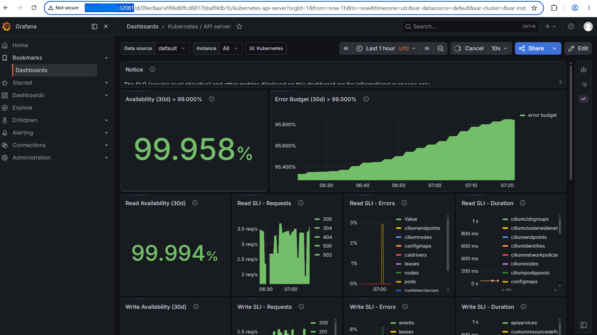

# Kubernetes Gateway API Setup

## What & Why

Deployed **Kubernetes Gateway API** (standard) alongside Traefik for vendor-agnostic routing.

**Why:**
- Kubernetes standard (not Traefik-specific)
- Portable: switch controllers (Kong, Envoy) anytime
- Future-proof for enterprise platforms

## Quick Setup

### Install Gateway API CRDs

```bash
kubectl apply -f https://github.com/kubernetes-sigs/gateway-api/releases/download/v1.0.0/standard-install.yaml
```

### Create Gateway

```bash
kubectl apply -f - <<EOF
apiVersion: gateway.networking.k8s.io/v1
kind: Gateway
metadata:
  name: traefik-gateway
  namespace: traefik
spec:
  gatewayClassName: traefik
  listeners:
  - name: http
    port: 8081
    protocol: HTTP
    allowedRoutes:
      namespaces:
        from: All
EOF
```

### Create HTTPRoutes

```bash
kubectl apply -f - <<EOF
apiVersion: gateway.networking.k8s.io/v1
kind: HTTPRoute
metadata:
  name: grafana-httproute
  namespace: monitoring
spec:
  parentRefs:
  - name: traefik-gateway
    namespace: traefik
  rules:
  - matches:
    - path:
        type: PathPrefix
        value: /
    backendRefs:
    - name: prometheus-grafana
      port: 80
---
apiVersion: gateway.networking.k8s.io/v1
kind: HTTPRoute
metadata:
  name: prometheus-httproute
  namespace: monitoring
spec:
  parentRefs:
  - name: traefik-gateway
    namespace: traefik
  hostnames:
  - "prometheus.local"
  rules:
  - matches:
    - path:
        type: PathPrefix
        value: /
    backendRefs:
    - name: prometheus-kube-prometheus-prometheus
      port: 9090
---
apiVersion: gateway.networking.k8s.io/v1
kind: HTTPRoute
metadata:
  name: alertmanager-httproute
  namespace: monitoring
spec:
  parentRefs:
  - name: traefik-gateway
    namespace: traefik
  hostnames:
  - "alertmanager.local"
  rules:
  - matches:
    - path:
        type: PathPrefix
        value: /
    backendRefs:
    - name: prometheus-kube-prometheus-alertmanager
      port: 9093
EOF
```

## Verify

```bash
kubectl get gateway -n traefik
kubectl get httproutes -n monitoring
```

## Access
http://<CLUSTER_NODE_IP>:32081 (I can now access the grafana via the Gateway API port)

