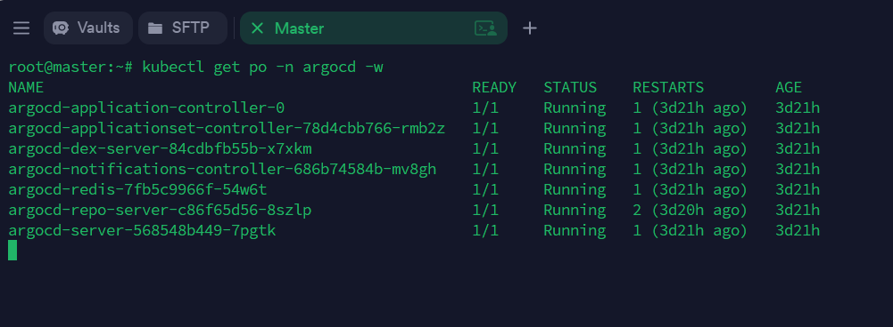
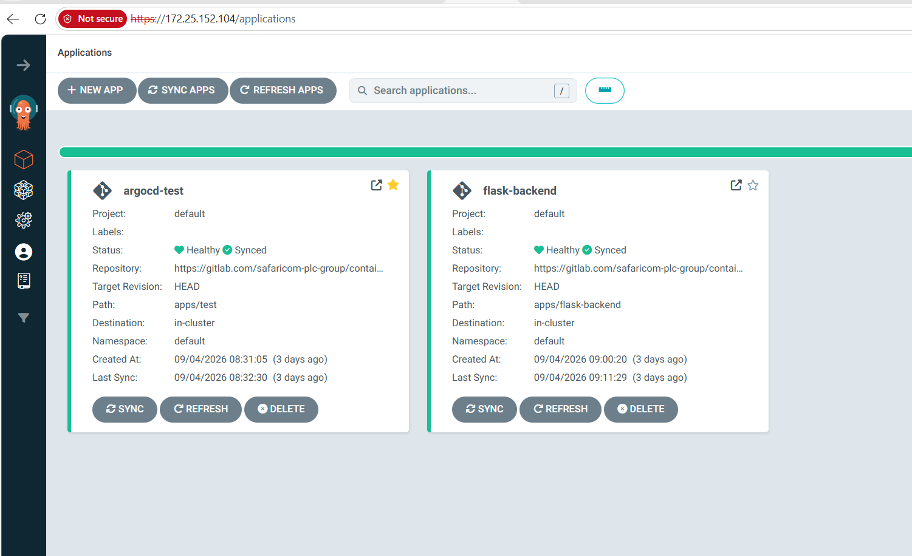

# Setting Up ArgoCD for GitOps on My k8s-kvm-lab Cluster

I wanted to stop deploying to my lab cluster by hand and start managing it the GitOps way -> git as the single source of truth, ArgoCD as the thing that actually applies changes. Here's what I did, step by step, and what each command actually did when I ran it.

Official reference I followed: [Argo CD Getting Started -> official docs](https://argo-cd.readthedocs.io/en/stable/getting_started/)
Additional resource : [Installing on Kunernetes](https://computingforgeeks.com/install-argocd-kubernetes/)

---

## 1. Installed ArgoCD

I created a dedicated namespace and applied the official install manifest.

```bash
kubectl create namespace argocd
kubectl apply -n argocd --server-side --force-conflicts \
  -f https://raw.githubusercontent.com/argoproj/argo-cd/stable/manifests/install.yaml
```
I ran this. It created the `argocd` namespace and deployed every ArgoCD component into it -> server, repo-server, application-controller, redis, dex, notifications-controller.

```bash
kubectl get pods -n argocd -w
```
I ran this to watch the pods come up. Once every pod showed `Running`, I moved on.


---

## 2. Installed the ArgoCD CLI

```bash
curl -sSL -o argocd-linux-amd64 https://github.com/argoproj/argo-cd/releases/latest/download/argocd-linux-amd64
sudo install -m 555 argocd-linux-amd64 /usr/local/bin/argocd
rm argocd-linux-amd64
```
I ran this. It downloaded the ArgoCD CLI binary and installed it system-wide, so `argocd` works as a command from anywhere.

---

## 3. Accessed the ArgoCD UI

I tried `kubectl port-forward` first, but that only binds to the machine I run it on. Since I'm on a separate Windows laptop browsing to a remote master node, `localhost` in port-forward meant the master's localhost, not mine -> that gave me `ERR_CONNECTION_REFUSED`.

I switched to NodePort instead:

```bash
kubectl -n argocd patch svc argocd-server -p '{"spec": {"type": "NodePort"}}'
```
I ran this. It changed the ArgoCD server Service from ClusterIP to NodePort, exposing it on a random high port across every node.

```bash
kubectl -n argocd get svc argocd-server -o jsonpath='{.spec.ports[?(@.name=="https")].nodePort}'
```
I ran this to get the actual assigned port, then browsed to `https://<node-ip>:<that-port>` -> that got me into the UI.

---

## 4. Got the initial admin password, then changed it

```bash
kubectl -n argocd get secret argocd-initial-admin-secret \
  -o jsonpath="{.data.password}" | base64 -d
```
ran this. It decoded and printed the auto-generated admin password from the secret ArgoCD creates on install.

I logged in with `admin` and that password, then immediately changed it:

```bash
argocd login <node-ip>:<port>
argocd account update-password
```
I ran this. It authenticated the CLI session and let me set a real password instead of the auto-generated one.

---

## 5. Connected my GitLab repo

My GitOps source repo: `gitlab.com/safaricom-plc-group/container-platform`

I generated a GitLab fine-grained personal access token scoped to just this project, with `Code: Download` permission -> that's the specific scope ArgoCD needs to read a repo. My first attempt used the wrong resource ("Repository" instead of "Code") and got rejected, so worth noting: it's `Code`, not `Repository`.

```bash
argocd repo add https://gitlab.com/safaricom-plc-group/container-platform.git \
  --username scripted.muigai
```
I ran this, leaving `--password` off so the CLI prompts for the token on a hidden input line instead of it sitting in my shell history or anywhere visible. It connected the repo to ArgoCD.

```bash
argocd repo list
```
I ran this to confirm. Status showed `Successful`.

For pushing to the repo myself (not ArgoCD's job), I generated a **second** token with `Code: Push` scope, kept separate from the read-only one ArgoCD uses. Two tokens, two purposes -> ArgoCD only ever reads, I'm the only one who writes.

---

## 6. Set up a git credential helper

So I'm not retyping the push token every time:

```bash
git config --global credential.helper store
```
I ran this. On the next push it asked once, then cached the credentials in `~/.git-credentials` in plaintext. That's an acceptable tradeoff on a personal lab VM where I'm the only root user -> not something I'd do on shared or production infrastructure.

---

## 7. Created my first Application -> a test namespace

Before touching anything real, I proved the loop with a throwaway manifest:

```yaml
# apps/test/namespace.yaml
apiVersion: v1
kind: Namespace
metadata:
  name: argocd-test
```

I committed and pushed it, then created the Application:

```bash
argocd app create argocd-test \
  --repo https://gitlab.com/safaricom-plc-group/container-platform.git \
  --path apps/test \
  --dest-server https://kubernetes.default.svc \
  --dest-namespace default
```
I ran this. It created an ArgoCD Application record pointing at that repo path.

```bash
argocd app sync argocd-test
```
I ran this. It compared git to the cluster, found the namespace missing, and created it.

```bash
kubectl get namespace argocd-test
```
I ran this to confirm -> namespace existed, `Active`. Full loop proven: file in git → ArgoCD → real resource on the cluster.

---

## 8. Adopted an existing workload -> flask-backend

This was the real test: bringing something *already running* under GitOps, without breaking it.

`flask-backend` was already deployed on my cluster, but I had no manifest file for it anywhere -> it must have been applied directly at some point with nothing kept in git. So I pulled the live definition straight from the cluster:

```bash
kubectl get deployment flask-backend -o yaml > ~/flask-backend-deployment.yaml
```
I ran this. It dumped the running Deployment's full definition to a file.

I stripped out everything Kubernetes injects automatically and doesn't belong in git -> the `status` block, `resourceVersion`, `uid`, `creationTimestamp`, the stale `last-applied-configuration` annotation, and defaulted fields like `imagePullPolicy`. What was left was the actual desired-state config: image, replicas, ports, probes, resources, the `harbor-secret` image pull reference.

I committed the cleaned file to `apps/flask-backend/deployment.yaml`, then created the Application the same way as before, and checked the diff **before** syncing, since this one had real pods behind it:



```bash
argocd app diff flask-backend
```
I ran this. It showed exactly one line of difference -> ArgoCD wanting to add its own `tracking-id` annotation. Nothing about the actual running app would change.

```bash
argocd app sync flask-backend
```
I ran this. It patched in that annotation only. Checked immediately after:

```bash
kubectl get pods -l app=flask-backend
```
Same pod names, same restart counts, no downtime. ArgoCD had taken ownership without disturbing anything already running.

---

## 9. Tested a real change -> scaling via git

To prove the point of doing this at all, I edited the replica count in the git file itself, not on the cluster:

```yaml
replicas: 3  # was 2
```

Pushed it, then had to do two separate things -> which tripped me up the first time, since I assumed pushing to git alone would trigger something:

```bash
argocd app get flask-backend --refresh
```
I ran this. It told ArgoCD to check git *right now* instead of waiting for its normal poll interval. Only at this point did it flag `OutOfSync`.

```bash
argocd app sync flask-backend
```
I ran this. Only now did the cluster actually change -> Kubernetes created a third pod. The original two were untouched throughout.

**The lesson that stuck:** ArgoCD noticing a change and ArgoCD acting on a change are two different, deliberate steps. Nothing happens to the cluster between a `git push` and running `sync` -> that gap is the safety net, not a bug.

---

## Resources

- [Argo CD Getting Started (official)](https://argo-cd.readthedocs.io/en/stable/getting_started/)
- [Argo CD Application CRD reference (official)](https://argo-cd.readthedocs.io/en/stable/operator-manual/application.yaml/)
- [GitLab Personal Access Tokens docs](https://docs.gitlab.com/user/profile/personal_access_tokens/)
- [Awesome GitOps -> curated resource list, for computing geeks who want to go deeper](https://github.com/weaveworks/awesome-gitops)